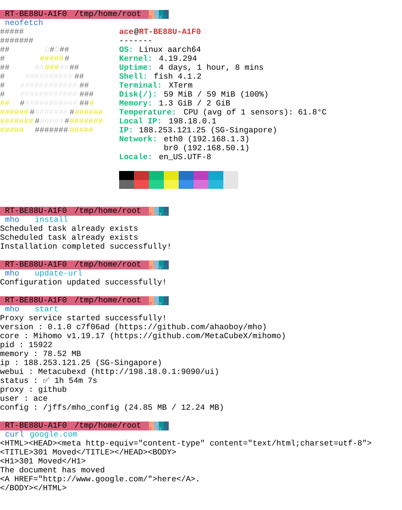

# Mho

[](https://github.com/ahaoboy/mho-tauri)

A Rust-based proxy core management tool supporting Clash/Mihomo/SingBox and other proxy cores. This is a Rust port of [ShellCrash](https://github.com/juewuy/ShellCrash).

## Features

- 🚀 Cross-platform support (Linux, macOS, Windows, Android)
- 📦 Automatic download and installation of proxy cores
- 🔄 Automatic configuration and GeoIP database updates
- 🌐 Multiple Web UI support (Metacubexd, Yacd)
- ⏰ Scheduled task support (automatic config and database updates)
- 🔧 Flexible configuration management
- 🪞 Multiple GitHub mirror support for accelerated downloads

<div style="display: flex;">
  
</div>

## Desktop Client

A cross-platform desktop GUI client built with [Tauri](https://tauri.app/): **[mho-tauri](https://github.com/ahaoboy/mho-tauri)**

## Installation

### Quick Install

Install with a single command using the installation script:

```bash
bash <(curl -fsSL https://raw.githubusercontent.com/ahaoboy/mho/main/install.sh)
```

### Using Proxy for Faster Downloads

If GitHub access is slow, use a mirror:

```bash
# Using gh-proxy mirror
bash <(curl -fsSL https://raw.githubusercontent.com/ahaoboy/mho/main/install.sh) --proxy gh-proxy

curl -fsSL https://gh-proxy.com/https://github.com/ahaoboy/mho/blob/main/install.sh | sh -s -- --proxy gh-proxy
curl -fsSL https://xget.xi-xu.me/gh/ahaoboy/mho/raw/refs/heads/main/install.sh | sh -s -- --proxy xget

# Using xget mirror
bash <(curl -fsSL https://raw.githubusercontent.com/ahaoboy/mho/main/install.sh) --proxy xget

# Using jsdelivr CDN
bash <(curl -fsSL https://raw.githubusercontent.com/ahaoboy/mho/main/install.sh) --proxy jsdelivr
```

### mho-assets

https://github.com/ahaoboy/mho-assets


```bash
curl -fsSL https://cdn.jsdelivr.net/gh/ahaoboy/mho-assets@main/install.sh | sh -s -- --proxy jsdelivr

curl -fsSL https://gh-proxy.com/https://github.com/ahaoboy/mho-assets/blob/main/install.sh | sh -s -- --proxy gh-proxy

curl -fsSL https://cdn.statically.io/gh/ahaoboy/mho-assets/main/install.sh  | sh -s -- --proxy statically

curl -fsSL https://xget.xi-xu.me/gh/ahaoboy/mho-assets/raw/refs/heads/main/install.sh  | sh -s -- --proxy xget
```

### asusrouter


```bash

curl -fsSL https://gh-proxy.com/https://github.com/ahaoboy/mho-assets/blob/main/install.sh | sh -s -- --proxy gh-proxy --dir /jffs

```

### Custom Installation Directory

```bash
export EI_DIR=~/.local/bin
bash <(curl -fsSL https://raw.githubusercontent.com/ahaoboy/mho/main/install.sh)
```

### Build from Source

```bash
# Clone the repository
git clone https://github.com/ahaoboy/mho.git
cd mho

# Build
cargo build --release

# Install
cargo install --path .
```

## Usage

### Initialize and Install

```bash
# Install all components (core, ui, geo, task)
mho install

# Force reinstallation of all
mho install -f

# Install specific components
mho install core        # Install proxy core only
mho install ui          # Install web UI only
mho install geo         # Install GeoIP databases only
mho install task        # Install scheduled tasks only

# Force install specific component
mho install -f core
```

### Service Control

```bash
# Start proxy service
mho start

# Stop proxy service
mho stop

# Check service status
mho status
```

### Configuration Management (config subcommand)

All configuration options are now unified under the `config` subcommand:

```bash
# View all configuration as JSON
mho config

# Configuration URL
mho config url                # Show current URL
mho config url <config-url>   # Set configuration URL (support URL or local path)

# GitHub download proxy
mho config proxy              # Show current proxy
mho config proxy gh-proxy     # Set proxy (direct, gh-proxy, xget, jsdelivr, etc.)

# Web UI type
mho config ui                 # Show current UI
mho config ui metacubexd      # Set UI (metacubexd, yacd)
# Web controller host
mho config host               # Show current host
mho config host :9090         # Set host

# Web controller secret
mho config secret             # Show current secret
mho config secret <secret>    # Set secret

# Target platform
mho config target             # Show current target
mho config target x86_64-unknown-linux-musl  # Set target

# Other common targets
mho config target aarch64-unknown-linux-musl    # ARM64 Linux (musl)
mho config target x86_64-unknown-linux-gnu      # x86_64 Linux (gnu)
mho config target aarch64-unknown-linux-gnu     # ARM64 Linux (gnu)
mho config target x86_64-pc-windows-msvc        # Windows x64
mho config target aarch64-apple-darwin          # macOS Apple Silicon
mho config target x86_64-apple-darwin           # macOS Intel

# Maximum runtime (hours, 0 = disabled)
mho config max-runtime        # Show current max-runtime
mho config max-runtime 24     # Set max-runtime to 24 hours
mho config max-runtime 0      # Disable automatic restart
```

### Scheduled Tasks

```bash
# Install scheduled tasks (via install subcommand)
mho install task

# Manually run scheduled task
mho run-task

# Remove scheduled tasks
mho remove-task
```

### Self-Upgrade

```bash
mho upgrade
```

### Shell Completions

Generate shell completion scripts for auto-completion:

```bash
# Bash - Add to your shell profile
mho completions bash > ~/.local/share/bash-completion/completions/mho
# Or source directly
source <(mho completions bash)

# Fish - Install to fish completions directory
mho completions fish > ~/.config/fish/completions/mho.fish

# Zsh
mho completions zsh > "${fpath[1]}/_mho"

# PowerShell
mho completions powershell >> $PROFILE

# Elvish
mho completions elvish > ~/.config/elvish/lib/mho.elv
```

### ei

```bash

mho ei ahaoboy/coreutils-build --name mktemp

mho ei ilai-deutel/kibi --proxy gh-proxy

```

## Configuration File

Configuration is stored next to the `mho` executable, in a portable
`mho_config/` subdirectory:

- `<mho_dir>/mho_config/mho_config.json`

Where `<mho_dir>` is the directory containing the `mho` binary (the
parent of `mho` / `mho.exe`). This makes an installation self-contained
and portable.

Example configuration:

```json
{
  "url": "https://example.com/config.yaml",
  "proxy": "Direct",
  "web": {
    "ui": "Metacubexd",
    "host": ":9090",
    "secret": "your-secret"
  }
}
```

## Supported Platforms

- Linux (x86_64, aarch64, armv7, i686) - musl/gnu
- macOS (x86_64, aarch64/Apple Silicon)
- Windows (x86_64, i686, aarch64)
- Android (aarch64, armv7, x86_64, i686)

## Scheduled Tasks

After installing scheduled tasks, the system will automatically:

- **Every Wednesday at 3:00 AM**: Update configuration files and GeoIP databases
- **Every 10 minutes**: Check and start proxy service (if not running)

### Linux/macOS (crontab)

```cron
0 3 * * 3 ~/.mho/mho run-task
*/10 * * * * ~/.mho/mho start
```

### Windows (Task Scheduler)

- `MhoRunTask`: Runs every Wednesday at 03:00
- `MhoStart`: Runs every 10 minutes

## Logging

Log files are written next to the `mho` executable, in:

- `<mho_dir>/mho_config/logs/mho.log` (current)
- `<mho_dir>/mho_config/logs/mho.log.1` … `mho.log.5` (rotated backups)

When `mho.log` reaches 1 MB it is rotated: `mho.log` → `mho.log.1` →
… → `mho.log.5` (the oldest is dropped). At most 6 files (~6 MB) are
kept, so log storage is bounded — important on flash-constrained devices
like routers. Timestamps are RFC 3339 UTC.

## Development

### Building

```bash
# Development build
cargo build

# Release build
cargo build --release

# Run tests
cargo test
```

## License

MIT License - see [LICENSE](LICENSE) file for details

## Acknowledgments

- [ShellCrash](https://github.com/juewuy/ShellCrash) - Original project
- [Clash](https://github.com/Dreamacro/clash) - Proxy core
- [Mihomo](https://github.com/MetaCubeX/mihomo) - Clash fork
- [SingBox](https://github.com/SagerNet/sing-box) - Universal proxy platform

## Contributing

Issues and Pull Requests are welcome!

## Links

- [GitHub Repository](https://github.com/ahaoboy/mho)
- [Mho Assets](https://github.com/ahaoboy/mho-assets)
- [Mho UI](https://github.com/ahaoboy/mho-ui)
- [metacubexd](https://github.com/MetaCubeX/metacubexd)
- [Issue Tracker](https://github.com/ahaoboy/mho/issues)
